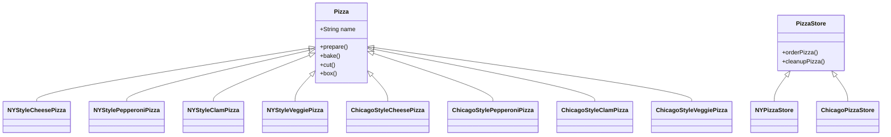
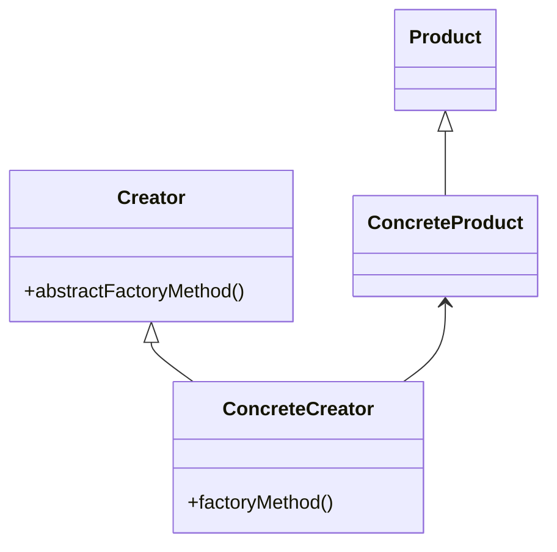

```mermaid
classDiagram
    Pizza <|-- NYStyleCheesePizza
    Pizza <|-- NYStylePepperoniPizza
    Pizza <|-- NYStyleClamPizza
    Pizza <|-- NYStyleVeggiePizza

    Pizza <|-- ChicagoStyleCheesePizza
    Pizza <|-- ChicagoStylePepperoniPizza
    Pizza <|-- ChicagoStyleClamPizza
    Pizza <|-- ChicagoStyleVeggiePizza
    class Pizza{
        +String name
        +prepare()
        +bake()
        +cut()
        +box()
    }

    PizzaStore <|-- NYPizzaStore
    PizzaStore <|-- ChicagoPizzaStore
    class PizzaStore{
        +orderPizza()
        +cleanupPizza()
    }
```

How Factory Method Pattern Works

```mermaid
classDiagram
    Product <|-- ConcreteProduct
    Creator <|-- ConcreteCreator
    ConcreteProduct <-- ConcreteCreator
    class Creator{
        +abstractFactoryMethod()
    }
    class ConcreteCreator{
        +factoryMethod()
    }
```