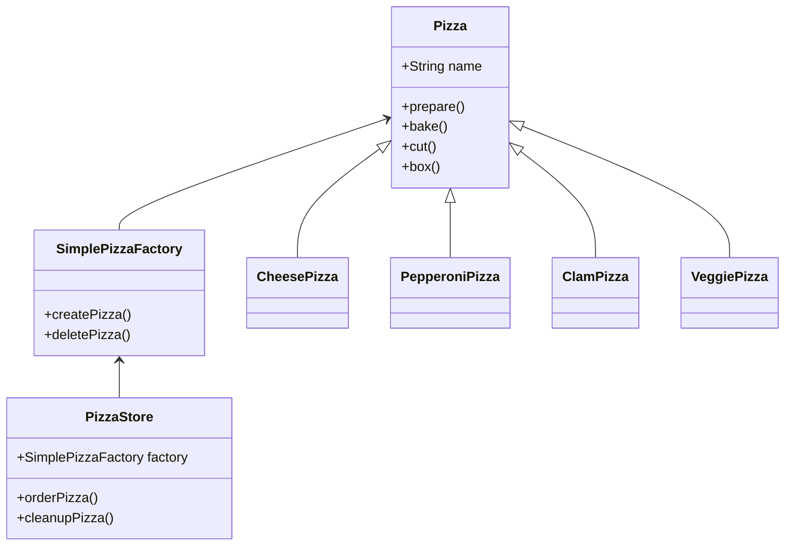

```mermaid
classDiagram
    Pizza <-- SimplePizzaFactory
    SimplePizzaFactory <-- PizzaStore

    Pizza <|-- CheesePizza
    Pizza <|-- PepperoniPizza
    Pizza <|-- ClamPizza
    Pizza <|-- VeggiePizza

    class Pizza{
        +String name
        +prepare()
        +bake()
        +cut()
        +box()
    }

    class SimplePizzaFactory{
        +createPizza()
        +deletePizza()
    }

    class PizzaStore{
        +SimplePizzaFactory factory
        +orderPizza()
        +cleanupPizza()
    }
```